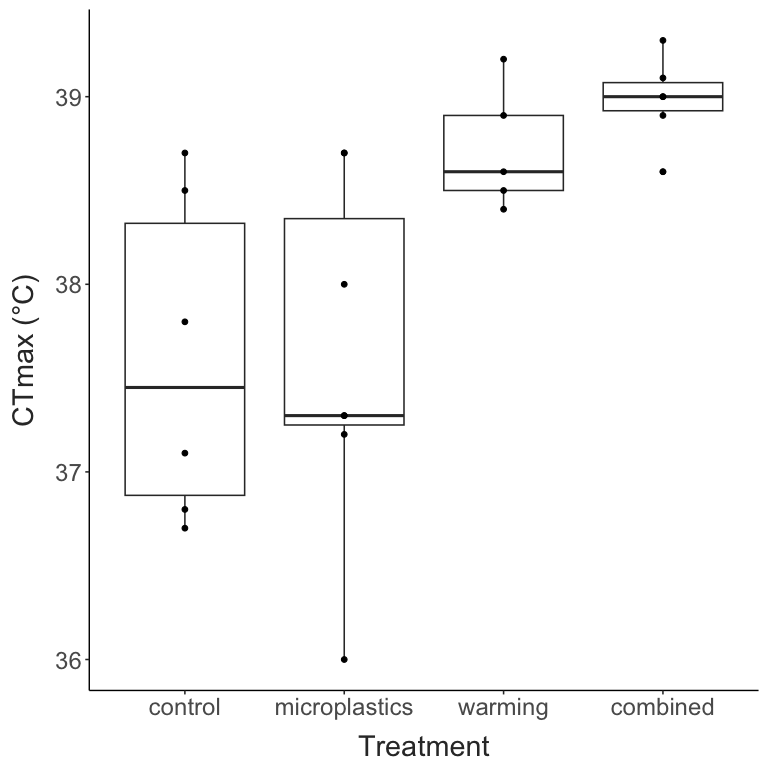
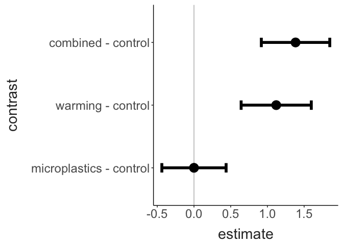

*Skistodiaptomus pallidus* Temperature and Microplastics (STAMP)
================
2026-08-17

- [Initial Replicate](#initial-replicate)
- [Experimental Data](#experimental-data)

## Initial Replicate

This replicate used the lab culture from Centennial Park, collected
during Summer 2025.

``` r

prelim_data %>% 
  drop_na() %>% 
  ggplot(aes(x = treatment, y = ctmax)) + 
  geom_boxplot() +
  geom_point() + 
  ylim(35.5,37.5) + 
  labs(x = "Treatment", 
       y = "CTmax (°C)") + 
  theme_matt()
```


## Experimental Data

``` r

ctmax_data %>% 
  ggplot(aes(x = treatment, y = ctmax)) + 
  geom_boxplot() +
  geom_point() + 
  labs(x = "Treatment", 
       y = "CTmax (°C)") + 
  theme_matt()
```



``` r

ctmax.model = lmer(data = ctmax_data, 
                   ctmax ~ treatment + (1|tube) + (1|assay_num))

summary(ctmax.model)
## Linear mixed model fit by REML. t-tests use Satterthwaite's method ['lmerModLmerTest']
## Formula: ctmax ~ treatment + (1 | tube) + (1 | assay_num)
##    Data: ctmax_data
## 
## REML criterion at convergence: 49.9
## 
## Scaled residuals: 
##      Min       1Q   Median       3Q      Max 
## -2.26998 -0.47646 -0.04729  0.47882  1.56061 
## 
## Random effects:
##  Groups    Name        Variance Std.Dev.
##  tube      (Intercept) 0.0000   0.0000  
##  assay_num (Intercept) 0.0000   0.0000  
##  Residual              0.4968   0.7049  
## Number of obs: 24, groups:  tube, 9; assay_num, 4
## 
## Fixed effects:
##                          Estimate Std. Error         df t value Pr(>|t|)    
## (Intercept)             3.760e+01  2.878e-01  2.000e+01 130.667  < 2e-16 ***
## treatmentmicroplastics -3.849e-14  3.921e-01  2.000e+01   0.000  1.00000    
## treatmentwarming        1.120e+00  4.268e-01  2.000e+01   2.624  0.01625 *  
## treatmentcombined       1.383e+00  4.069e-01  2.000e+01   3.399  0.00285 ** 
## ---
## Signif. codes:  0 '***' 0.001 '**' 0.01 '*' 0.05 '.' 0.1 ' ' 1
## 
## Correlation of Fixed Effects:
##             (Intr) trtmntm trtmntw
## trtmntmcrpl -0.734                
## trtmntwrmng -0.674  0.495         
## trtmntcmbnd -0.707  0.519   0.477 
## optimizer (nloptwrap) convergence code: 0 (OK)
## boundary (singular) fit: see help('isSingular')

car::Anova(ctmax.model, type = "III")
## Analysis of Deviance Table (Type III Wald chisquare tests)
## 
## Response: ctmax
##                 Chisq Df Pr(>Chisq)    
## (Intercept) 17073.823  1  < 2.2e-16 ***
## treatment      19.531  3  0.0002123 ***
## ---
## Signif. codes:  0 '***' 0.001 '**' 0.01 '*' 0.05 '.' 0.1 ' ' 1
```

``` r

emmeans(ctmax.model, ~treatment) |> pairs() |> as_tibble()
## # A tibble: 6 × 6
##   contrast                  estimate    SE    df   t.ratio p.value
##   <chr>                        <dbl> <dbl> <dbl>     <dbl>   <dbl>
## 1 control - microplastics   3.85e-14 0.438  17.3  8.80e-14  1     
## 2 control - warming        -1.12e+ 0 0.478  18.1 -2.34e+ 0  0.125 
## 3 control - combined       -1.38e+ 0 0.466  18.2 -2.97e+ 0  0.0374
## 4 microplastics - warming  -1.12e+ 0 0.452  18.1 -2.48e+ 0  0.0973
## 5 microplastics - combined -1.38e+ 0 0.433  18.3 -3.19e+ 0  0.0234
## 6 warming - combined       -2.63e- 1 0.466  16.2 -5.65e- 1  0.941
```

``` r

contrasts = emmeans(ctmax.model, ~treatment) |> contrast(method = "trt.vs.ctrl") |> as_tibble() |> 
  mutate(contrast = fct_relevel(contrast, 
                                "microplastics - control",
                                "warming - control", 
                                "combined - control"))
  
contrasts |> 
  ggplot(aes(x = contrast, y = estimate)) +
  geom_hline(yintercept = 0, colour = "grey") + 
  geom_errorbar(aes(ymin = estimate - SE, ymax = estimate + SE),
                width = 0.15, linewidth = 2) + 
  geom_point(size = 6) + 
  coord_flip() + 
  theme_matt()
```


